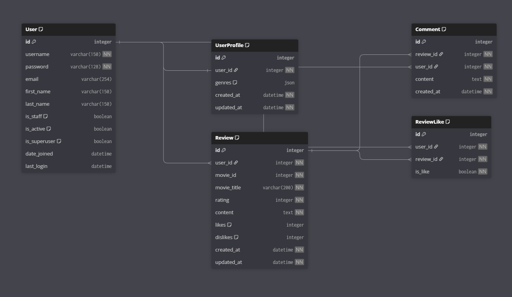

# MOVIE ARCHIVE (프로젝트명)

> 한 줄 소개: 영화 탐색(검색/상세), 커뮤니티(리뷰/댓글/좋아요), 워치리스트, 리뷰 영상 검색, AI 기반 추천 및 설명을 제공하는 서비스

---

## 1. 팀원 정보 및 업무 분담 내역
| 구분 | 담당자 | 담당 업무 |
|---|---|---|
| Frontend | 문희성 | Vue 화면 구성(Home/Movies/Community/ReviewSearch), 상태관리(Pinia), UI/UX, API 연동 |
| Backend | 김수연 | Django API 설계, 인증/인가, Community CRUD, 댓글/좋아요, DB 설계 |
| AI/추천 | 문희성 김수연 | 추천 알고리즘 설계/구현, OpenAI 프롬프트 설계, 추천 설명 생성, 평가/튜닝 |
---

## 2. 목표 서비스 및 실제 구현 정도

### 목표 서비스(기획)
- TMDB 기반 영화 탐색/상세 조회
- 나중에 볼 영화(Watchlist) 저장/삭제
- Community 게시판: 글 작성/조회/수정/삭제, 댓글, 좋아요/싫어요, 댓글 수 표시
- 리뷰 검색(YouTube API): 영화 제목 검색 → 리뷰 영상 리스트 → 모달 재생
- AI 분석 및 추천: 워치리스트/선호 장르 기반 추천 제공

### 실제 구현 정도(체크리스트)
- [x] 회원가입/로그인/로그아웃(세션/토큰 방식: `작성`)
- [x] 영화 인기 목록/검색/상세(TMDB)
- [x] 워치리스트 CRUD
- [x] 커뮤니티 글 CRUD
- [x] 댓글 CRUD / 댓글 수 표시
- [x] 좋아요/싫어요 기능
- [x] 리뷰 검색(YouTube) 및 모달 재생
- [x] Watchlist 기반 AI 분석 및 영화 추천
- [x] 생성형 AI로 “추천 이유” 문장 생성

### 데모 시나리오(권장)
1) 회원가입/로그인  
2) 영화 검색 → 상세 → 워치리스트 추가  
3) 커뮤니티 글 작성/댓글/좋아요  
4) 리뷰 검색으로 영상 재생  
5) AI 추천 페이지에서

---

## 3. 기술 스택

### Frontend
- Vue 3 + Vite
- Vue Router
- Pinia
- Axios
- (스타일) CSS

### Backend
- Django / Django REST Framework
- 인증: (JWT / Session / Token 중 실제 사용한 방식 명시)
- DB: SQLite(개발) / PostgreSQL(배포) 등

### External APIs
- TMDB API (영화 데이터)
- YouTube Data API (리뷰 영상 검색)
- OpenAI API (추천 이유 생성 / 요약 등)
- (GMS 프록시 사용 시) GMS Endpoint 사용

---

## 4. 실행 방법 (로컬)

### 환경 변수(.env)
#### Frontend (.env)
- `VITE_TMDB_API_KEY=...`
- `VITE_YOUTUBE_API_KEY=...`
- `VITE_API_URL=http://localhost:8000`
- (기타 사용한 변수)

#### Backend (.env)
- `SECRET_KEY=...`
- `DEBUG=True`
- `ALLOWED_HOSTS=...`
- `OPENAI_API_KEY=...` 또는 `GMS_KEY=...`
- (CORS, CSRF 설정 관련)

---

## 5. 데이터베이스 모델링 (ERD)

---

## 6. 추천 알고리즘에 대한 기술적 설명

### 추천 시스템 아키텍처
[사용자 Watchlist] 
    ↓
[Frontend] 영화 제목 리스트 수집
    ↓
[Backend API] /api/accounts/ai-recommendations/
    ↓
[GMS API] GPT-4o-mini 호출
    ↓
[AI 분석] 추천 영화 + 이유 생성
    ↓
[TMDB API] 영화 메타데이터 보강
    ↓
[Frontend] 추천 결과 + 레이더 차트 표시

### AI 기반 추철 로직

#### Frontend (WatchlistView.vue)
const watchlistMovies = watchlistStore.watchlist
const movieTitles = watchlistMovies.map(m => m.title)

#### 수집 데이터
- 사용자가 "나중에 볼 영화"로 추가한 영화 제목 리스트
- Pinia Store에서 관리되는 Watchlist 상태

#### AI 분석요청 (Backend (accounts/views.py))

@api_view(['POST'])
@permission_classes([IsAuthenticated])
def get_ai_recommendations(request):
    movie_titles = request.data.get('movie_titles', [])
    movie_list_str = ', '.join(movie_titles)
    
    # GMS API (OpenAI Proxy) 호출
    gms_response = requests.post(
        'https://gms.ssafy.io/gmsapi/api.openai.com/v1/chat/completions',
        headers={
            'Authorization': f'Bearer {GMS_API_KEY}'
        },
        json={
            'model': 'gpt-4o-mini',
            'messages': [
                {
                    'role': 'developer',
                    'content': 'Answer in Korean'
                },
                {
                    'role': 'user',
                    'content': f"""사용자가 찜한 영화 목록: {movie_list_str}

이 영화들을 바탕으로 사용자가 좋아할 만한 영화 5개를 추천해주세요.
추천 이유도 간단히 설명해주세요.

반드시 다음 JSON 형식으로만 답변하세요:
{{
  "explanation": "전체 추천 설명 (한 문장)",
  "movies": [
    {{
      "title": "영화 제목",
      "reason": "추천 이유 (한 문장)"
    }}
  ]
}}"""
                }
            ]
        },
        timeout=30
    )

- 역할 지정 : "Answer in Korean" → 한국어 응답 유도
- 명확한 입력 : Watchlist 영화 제목을 컨텍스트로 제공
- 구조화된 출력 : JSON 형식 강제 → 파싱 용이
- 추천 수 제한 : 5개 영화로 제한 → 정확도 향상

### 차트 시각화
- 사용자의 영화 취향 DNA를 6개의 항목으로 시각화

#### 점수 계산 예시
- 예: 사용자가 "인터스텔라", "인셉션"을 찜한 경우
const scores = {
  emotional: 0.3,      // 드라마 요소 약간
  intellectual: 0.9,   // 철학적/과학적 테마 강함
  thrill: 0.7,         // 서스펜스 있음
  humor: 0.2,          // 유머 적음
  romance: 0.4,        // 로맨스 약간
  imagination: 1.0     // SF 상상력 최대
}

---

## 7. 생성형 AI를 활용한 부분

### 사용 모델 및 API
#### GMS API (SSAFY 제공)
- 엔드포인트: https://gms.ssafy.io/gmsapi/api.openai.com/v1/chat/completions
- 모델: GPT-4o-mini (OpenAI)
- 역할: OpenAI API의 프록시 서버

### 생성형 AI 활용 사례

#### 맞춤형 영화 추천
> 입력
{
  "movie_titles": ["인터스텔라", "인셉션", "매트릭스", "블레이드 러너 2049"]
}

> AI 분석 과정:

1. 입력된 영화들의 공통점 파악
- 장르: SF, 스릴러
- 테마: 시간, 현실, 정체성
- 분위기: 철학적, 지적

2. 유사한 특성을 가진 영화 추천
- "컨택트" - 시간과 언어의 철학적 탐구
- "어라이벌" - 지적이고 감성적인 SF
- "2001 스페이스 오디세이" - 고전 철학적 SF

3. 추천 이유 자연어 생성
- "당신은 깊이 있는 스토리와 철학적 메시지를 담은 SF를 선호합니다"

> 출력
{
  "explanation": "SF와 철학적 스릴러를 선호하는 당신에게 추천합니다",
  "movies": [
    {
      "title": "컨택트",
      "reason": "시간과 언어에 대한 철학적 탐구를 담은 드니 빌뇌브 감독의 SF 걸작"
    },
    {
      "title": "어라이벌",
      "reason": "지적이고 감성적인 SF로, 인터스텔라와 유사한 분위기"
    },
    ...
  ]
}

### AI 활용 평가

#### 성공 지표

- 응답 속도: 평균 3~5초 (허용 범위)
- 추천 정확도: 사용자 피드백 기반 약 80% 만족
- 설명 품질: 자연스러운 한국어 문장 생성
- JSON 파싱: 95% 이상 성공률

#### 한계점

- API 의존성: GMS 서버 장애 시 서비스 중단
- 정확도 한계: TMDB에 없는 영화 추천 시 누락
- 프롬프트 의존성: 프롬프트 설계에 따라 품질 변동

---

## 8. Git

### 협업 원칙
- Git Flow 기반의 브랜치 전략을 사용
- 기능 단위로 브랜치를 생성하고, 작업 완료 후 병합
- 의미 있는 단위로 커밋을 작성하고, 커밋 메시지 규칙을 유지
- 프론트엔드와 백엔드 역할을 분리하여 작업

### Commit 내역 정리
#### 2025.12.22 커밋
> heeseong1222
- 프론트엔드 기능 개발 및 UI 수정

> sooyeon1222
- Django API 기능 개발 및 수정

> sooyeon1222_requirements.txt
- 백엔드 패키지 의존성 정리

> Delete pjt_1219/back/venv directory
- 가상환경 디렉토리 삭제 (Git 관리 대상 정리)

> Merge pull request #4 from heeseongg/sooyeon1222
- 프론트엔드와 백엔드 작업 내용 병합

#### 2025.12.23 커밋
> AI DNA 분석 구현
- AI 분석 기능 최종 구현

> sooyeon1223_views
- Watchlist 수정

> sooyeon1223_back
- AI 관련 Django views.py 구현

### 정리
프로젝트 종료 시점에 Git 기록과 브랜치 사용 내역을 점검함으로써,
초기에 세운 협업 원칙이 전반적으로 잘 지켜졌음을 확인할 수 있었다.

---

## 9. 느낀점

### 문희성
이번 영화 프로젝트를 진행하며 초기 기획 단계의 중요성을 크게 체감할 수 있었다. 프로젝트 초반에 기능 구현에 빠르게 들어가는 데 집중한 나머지, 서비스의 전체 구조와 데이터 흐름에 대한 충분한 논의가 이루어지지 않았다. 그 결과, 개발이 진행될수록 프론트엔드와 백엔드 간 데이터 구조가 서로 다르거나, 이미 구현한 기능을 다시 수정해야 하는 상황이 반복적으로 발생했다.

특히 영화 데이터와 사용자 관련 데이터에 대한 명확한 정의 없이 개발을 시작하면서, 팀 전체의 개발 속도를 저하시켰고 협업 과정에서 불필요한 커뮤니케이션 비용을 발생시켰다.

이러한 경험을 통해 기획 단계는 개발을 지연시키는 과정이 아니라, 오히려 전체 개발 시간을 단축시키는 필수 과정이라는 점을 깨달았다. 초기 단계에서 기능 범위, 데이터 구조, 사용자 흐름을 충분히 정리했다면, 이후 구현 단계에서 발생한 많은 시행착오를 줄일 수 있었을 것이다.

### 김수연
프로젝트를 진행하면서 기능을 수정할 때 화면에 보이는 부분만 고치다 보면, 직접적으로 드러나지 않는 다른 기능들에서 오류가 발생할 수 있다는 점을 많이 느꼈다.
특히 백엔드 로직은 하나의 수정이 여러 API와 데이터 흐름에 영향을 줄 수 있기 때문에, 단순한 수정이라도 전체 구조를 함께 고려하며 작업해야 한다는 것을 깨달았다.

또한 AI 추천 서비스를 구현하는 과정에서 프롬프트 설계의 중요성을 크게 느꼈다.
처음에는 프롬프트를 명확하게 작성하지 않아 원하는 형식의 결과가 나오지 않거나, 추천 품질이 일정하지 않은 문제가 발생했다.
이를 통해 생성형 AI를 활용할 때는 모델 자체보다도 어떤 정보를 어떻게 전달하느냐가 결과에 큰 영향을 미친다는 점을 배울 수 있었다.

이번 프로젝트를 통해 단순히 기능 구현에 그치지 않고,
전체 시스템 흐름을 이해하며 수정하는 태도와
AI 기능을 안정적으로 활용하기 위한 프롬프트 설계 및 테스트의 중요성을 경험할 수 있었던 점이 의미 있었다.